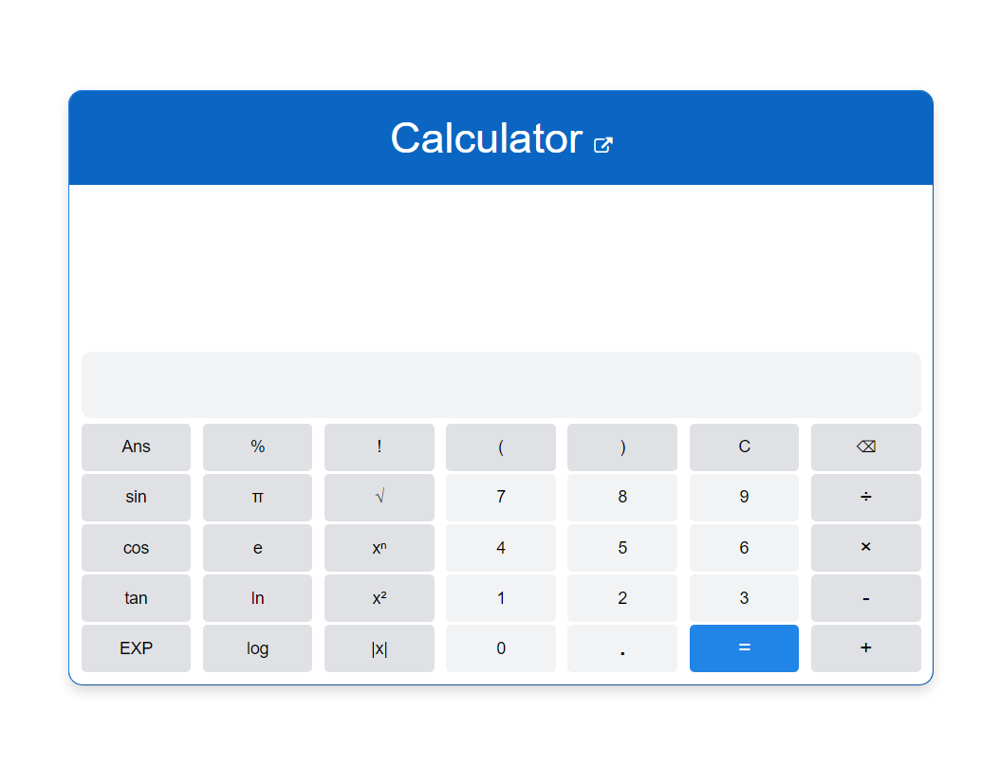

# Scientific Calculator

A fully functional scientific calculator built using HTML, CSS, and JavaScript.

## Features

- **Basic Arithmetic Operations:** Addition, subtraction, multiplication, division.
- **Advanced Mathematical Functions:** sin, cos, tan, log, ln, etc.
- **Constants:** π, e.
- **Keyboard Input Support:** Seamless integration with keyboard inputs.
- **Smart Input Interpretation:** Understands inputs even without proper parentheses or multiplication signs.
- **Parentheses Balancing Check:** Ensures all parentheses are balanced using a Stack data structure.
- **Intelligent Backspace Functionality:** Context-sensitive backspace action.

## Key Highlights

### Smart Backspace
The back button works intelligently. If pressed after a calculation, it clears the entire input. Otherwise, it deletes only the last character.

### Intelligent Input Interpretation
The calculator can understand user inputs even without proper parentheses or multiplication signs. For example:

